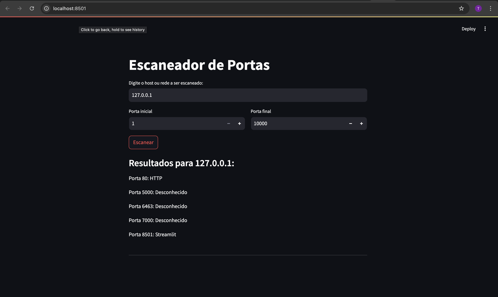

# Escaneador de Portas

Este é um projeto simples de escaneamento de portas utilizando `Streamlit`. O objetivo é permitir que você escaneie portas abertas em um host ou rede especificada, identificando serviços conhecidos em execução nessas portas.

## Como Executar o Projeto

1. **Instale as dependências necessárias**:
    ```bash
    pip install streamlit
    ```

2. **Execute o aplicativo Streamlit**:
    ```bash
    streamlit run port_scanner.py
    ```

3. **Acesse a interface web**:
   Após a execução do comando acima, abra seu navegador e vá até a URL fornecida pelo Streamlit, geralmente `http://localhost:8501`.

## Como Usar

1. **Digite o host ou rede a ser escaneado**:
   - Pode ser um IP como: (ex.: `127.0.0.1`) 

2. **Defina o intervalo de portas a serem escaneadas**:
   - Escolha as portas de início e fim para o escaneamento.

3. **Clique em "Escanear"**:
   - Os resultados do escaneamento serão exibidos na interface, mostrando as portas abertas e os serviços conhecidos em execução.


## Exemplo 


